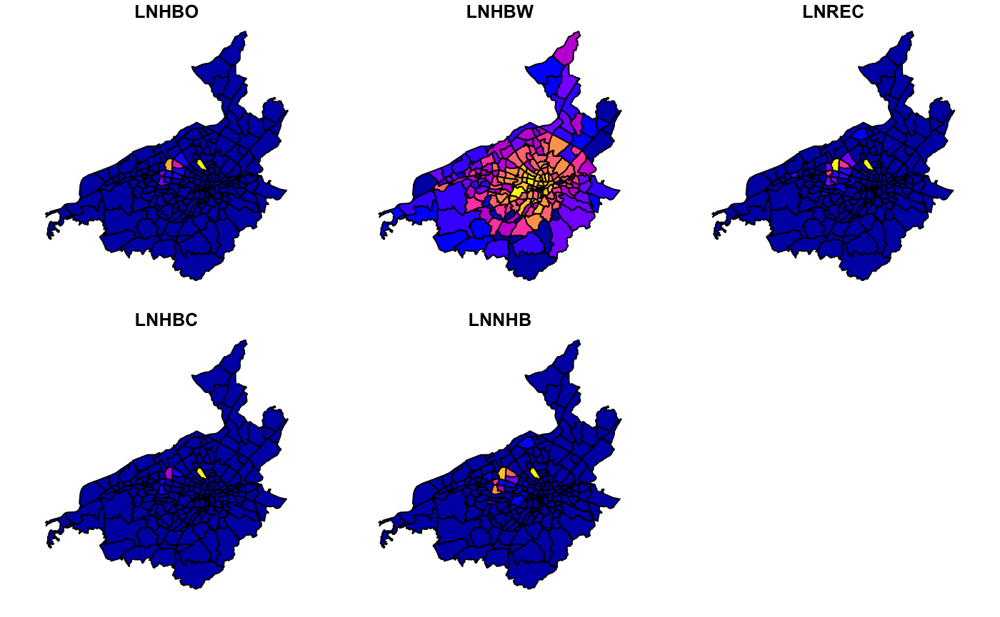
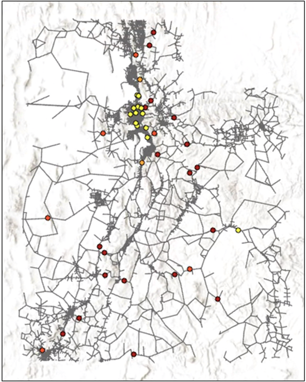

```{r init2, echo = FALSE}
library("foreign")
library("leaflet")
library("knitr")
library("sf")
library("sp")
```

# Methodology

## Input Data
The USTM Resiliency project uses many input data in order to effectively produce the output Destination Choice Logsum.

### Socioeconomic Data
Let's start by taking a look at the Socioeconomic data produced by the Utah Travel Study, conducted in 2012. This data summarizes information gathered from 10,000 randomly selected households in Utah. A small sampling is shown below:
```{r include = TRUE}
sedata <- read.dbf("Data/SE_USTM_BASE2015.DBF")
kable(sedata[c(1200,3300,4500,5500,6000,7500,8000,8500),1:9])
```
Here, we can see the attributes associated with each of the households on record. Some of the geographic areas in Utah are associated with MPOs, as indicated in the SUBAREAID column. There are only 4 MPOs in Utah, so many households, such as those in Grand and Uintah counites, do not have TAZIDs associated with them. We will also look at a summary of this data set:
```{r sedata}
kable(summary(sedata))
```

### MC Constans and Coefficients
Lets also take a look at the Mode Choice constants and coefficients:
```{r mcconst}
mcconst <- read.csv("Data/MC_Constants.csv")
kable(mcconst)
```

```{r mccoeff}
mccoeff <- read.csv("Data/MC_Coefficients.csv")
kable(mccoeff)
```

The Mode Choice Constants and Coefficients are used to help weight the inputs to correctly determine the Mode Choice Logsum output, that serves as the impedance term in the Destination Choice Logsum calculation. These inputs are taken from the Oregen Statewide Travel Model, and from the Roanokoke Valley Transportation Planning Organization. The Oregon model had well suited data for each of the five trip types except Home-based work trips, which is why we used the RVTPO data for HBW trip purposes. 

## Demonstration Model Framework

Figure 1 shows a schematic of the model framework. 
```{r image1, echo = FALSE}
include_graphics(('images/model_framework.png'))
```


The framework has three main inputs:	
A. Highway Network: The USTM model network was obtained from UDOT and forms the basis of the model.
B. Productions: Zonal trip productions from the USTM model  
C. Attractions: Zonal trip attractions from the USTM model
  
The model individually calculates mode choice and destination choice logsum values for each trip purpose, and then combines these outputs together. Thus, steps 3 and 4 of the model contain “children” processes with several groups of repeated code, once for each trip purpose. 

The mode choice model framework currently implemented is based on the Roanoke, Virginia travel model that serves as a basis for much of the code in the model. The USTM mode choice model uses similar alternatives and parameters, and we anticipate conflating and combining these coefficients in the next few weeks. The mode choice model includes utility parameters for in-vehicle travel time, out-of-vehicle travel time, wait time, automobile operating cost, and other elements for each trip purpose. The mode choice alternatives are drive alone, shared ride, non-motorized, and transit (all modes). USTM relies on MPO-level mode choice models to handle transit use, but in this application, it is important to consider transit as an available alternative. Work is underway to convert the minimum WFRC transit skim among all modes into a single “transit” skim at the USTM zone level.

The destination choice model uses the same purposes as the mode choice model, with utility equation coefficients including the zonal attractions as a size term and the mode choice log sum as an impedance term. The current demonstration model uses destination choice parameters and calibration constants derived from the Roanoke, Virginia model. Research into destination choice utility coefficients used in statewide models is ongoing, and a minimal calibration exercise will be reported at the next TAC meeting.

The outputs are then combined to create a single file with all of the destination choice log sum accessibility outputs. The final output of the model is the destination choice log sum, shown as an individual rowsum for each trip purpose. 

## Simulating a Broken Link Within the Demonstration Model
We conducted a sensitivity analysis where we simulated a broken highway link in our demonstration model to verify that the model was responding in an appropriate way. Figure 4 shows the change in the log sum value for each purpose resulting from breaking a single highway link across all trip purposes. In order to simulate the changes caused by a broken link, a link was removed from the network file; the model then uses updated highway travel times to compute the mode and destination choice log sums. In general, the change in log sums shows a reasonable response, but the link selected is a major facility for travel in all directions through Roanoke. We are currently investigating whether these unexpected results are the result of improper specification, or whether they reveal a genuine nuance within this particular application technique. 


```{r image2, echo = FALSE}

```

## Identifying Vulnerable Links
It is necessary for us to identify links in the UTSM network whose breaks we could simulate in our analysis. The AEM (2017) study inspiring this current work identified nine physical threat categories and locations of elevated risk to highway facilities on the I-15 corridor; the present analysis requires that we identify highway links at risk anywhere in Utah, and thus cannot rely only on the identification completed by AEM. An alternative method to identifying links vulnerable to specific risks would be to simply make arbitrary cuts in the network at locations the TAC identifies that could be representative of unknown threats or suspected choke points in the USTM network. The Risk Priority Analysis completed by BIO-WEST (2020) shows Composite Threat Probability by Road Segment. We used this analysis to identify 40 locations in the UTSM network that are either posed with an elevated annual threat or identified as a choke point. We also desired to have a mix of urban and rural facilities to demonstrate the potential flexibility of our proposed technique. 

```{r image3, echo = F}

```

## Leaflet Visualization
The following is a visualizaiton of the original DCLS values resulting from the broken link. This interactive map will display the home-based work attribute according to the TAZ that the mouse is currently hovering over. Ideally, this would be repeatable for each of the five trip purposes, 
```{r map, echo = FALSE}
map <- st_read("Data/RoanokeTAZ.shp")    
map <- st_transform(map, CRS("+proj=longlat +ellps=GRS80"))

labels <- sprintf(
  "<strong>%s</strong><br/>%g Destination Choice Logsum",
  broken_rowsum$TAZ, broken_rowsum$LNHBW
) %>% lapply(htmltools::HTML)

m <- leaflet() %>% setView(lng = -79.9414, lat = 37.2710, zoom = 11) %>% addTiles() %>%
  addPolygons(data=map,weight=1,col = 'black',smoothFactor = 0.5,
    opacity = 1.0, fillOpacity = 1,fillColor = ~colorQuantile("Blues", broken_rowsum$LNHBW)(broken_rowsum$LNHBW),
    highlightOptions = highlightOptions(color = "orange", weight = 3,
      bringToFront = TRUE),
    label = labels,
  labelOptions = labelOptions(
    style = list("font-weight" = "normal", padding = "3px 8px"),
    textsize = "15px",
    direction = "auto"))
m
```
